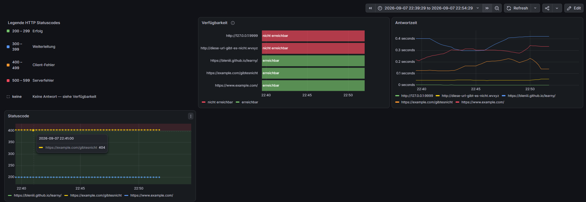

# Uptime Monitor

[](https://github.com/Bleniii/uptime-monitor/actions/workflows/tests.yml)

Prüft, ob konfigurierte Websites erreichbar sind, protokolliert das Ergebnis
und stellt es als Metriken für Prometheus bereit. Grafana zeigt den Verlauf.




## Status

- [x] URL-Abfrage mit Statuscode und Antwortzeit
- [x] Konfiguration über Datei, Logging
- [x] Fehlerbehandlung: Timeout, DNS-Fehler, Verbindungsfehler, HTTP-Fehler
- [x] Unit-Tests mit pytest und Mocking
- [x] Betrieb als systemd-Service
- [x] Docker-Container
- [x] GitHub-Actions-Pipeline mit Tests und Image-Build
- [x] `/metrics`-Endpoint für Prometheus
- [x] Prometheus und Grafana über docker compose
- [x] Dashboard: Verfügbarkeit, Antwortzeit, Statuscode
- [x] Datenquelle und Dashboard als Code provisioniert
- [x] `targets.txt` als Volume — Konfigurationsänderung ohne Rebuild
- [ ] Alarmregel für `uptime_erreichbar == 0`
- [ ] Metrik-Logik in eine testbare Funktion auslagern
- [ ] Code-Dokumentation nachführen

## Funktion

- Prüft die in `targets.txt` konfigurierten URLs alle 60 Sekunden
- Erfasst HTTP-Statuscode und Antwortzeit
- Unterscheidet Erfolg (INFO), HTTP-Fehler ab 400 (WARNING) und
  ausbleibende Antwort durch Timeout, DNS- oder Verbindungsfehler (ERROR)
- Schreibt nach stdout, damit systemd oder Docker das Logging übernehmen
- Stellt drei Metriken unter `/metrics` bereit

## Schnellstart

```bash
git clone https://github.com/Bleniii/uptime-monitor.git
cd uptime-monitor
docker compose up -d --build
```

| Dienst | Adresse | Zweck |
|---|---|---|
| Monitor | http://localhost:8000/metrics | Liefert die Messwerte |
| Prometheus | http://localhost:9090 | Sammelt und speichert sie |
| Grafana | http://localhost:3000 | Zeigt das Dashboard |

Grafana meldet sich mit `admin` / `admin`. Datenquelle und Dashboard werden
beim Start aus `grafana/provisioning/` eingelesen — nichts von Hand anlegen.

## Ziele pflegen

URLs stehen in `targets.txt`, eine pro Zeile. Die Datei ist als Volume
eingehängt, ein Rebuild ist nicht nötig:

```bash
docker compose restart monitor
```

Der Neustart ist erforderlich, weil die Liste beim Programmstart einmal
eingelesen wird.

## Metriken

| Metrik | Bedeutung |
|---|---|
| `uptime_erreichbar{url}` | 1 = Antwort erhalten, 0 = keine |
| `uptime_status{url}` | HTTP-Statuscode. Die Zeitreihe endet, sobald keine Antwort mehr kommt — ein stehengebliebener Wert wäre irreführend |
| `uptime_versuchsdauer_sekunden{url}` | Dauer des Versuchs, auch im Fehlerfall |

`uptime_erreichbar` und `uptime_status` beantworten verschiedene Fragen: Ein
404 bedeutet, dass der Server geantwortet hat. Für die Alarmierung ergibt das
zwei getrennte Regeln — eine für die Infrastruktur, eine für die Anwendung.

## Architektur

Prometheus erreicht den Monitor über den Servicenamen `monitor:8000` im
internen Compose-Netzwerk, Grafana erreicht Prometheus als `prometheus:9090`.
Die veröffentlichten Ports dienen nur dem Zugriff vom Host aus.

Zustandsdaten liegen in Named Volumes (`prometheus-data`, `grafana-data`),
Konfiguration wird schreibgeschützt aus dem Repository eingehängt.
`docker compose down` lässt die Volumes bestehen, `down -v` löscht sie —
betroffen ist dann die Messreihe, nicht das Dashboard.

## Entwicklung und Tests

```bash
python3 -m venv .venv
source .venv/bin/activate
pip install -r requirements-dev.txt
pytest -v
```

Die Tests für `pruefe_url` ersetzen `requests.get` durch einen Mock und laufen
ohne Netzwerkzugriff. Bei jedem Push und Pull Request führt GitHub Actions
dieselben Tests aus und baut das Image.

## Betrieb ohne Container

Der Compose-Stack ist die vorgesehene Betriebsart. Für Umgebungen ohne
Container-Laufzeit liegt unter `systemd/` eine Unit-Datei. Anzupassen:

```ini
User=<benutzername>
WorkingDirectory=<pfad-zum-projektordner>
ExecStart=<pfad-zum-projektordner>/.venv/bin/python monitor.py
```

```bash
sudo cp systemd/uptime-monitor.service /etc/systemd/system/
sudo systemctl daemon-reload
sudo systemctl enable --now uptime-monitor.service
journalctl -u uptime-monitor.service -f
```

Die Unit ist entstanden, bevor der Container dazukam, und bewusst erhalten
geblieben: Sie zeigt denselben Dienst einmal als Prozess unter systemd und
einmal als Container, mit denselben Anforderungen an Neustartverhalten und
Logging.

**Port 8000 ist einmal vergeben.** Compose-Stack und systemd-Dienst starten
dasselbe Programm auf demselben Port — die laufende Variante muss gestoppt
sein, bevor die andere startet.

## Weitere Dokumentation

| Datei | Inhalt |
|---|---|
| `CHEATSHEET.md` | Befehlsreferenz für den Alltag |
| Konzeptdokument | Aufbau, Anwendungsfälle, Entwurfsentscheidungen |
| Projektdokumentation | Ablauf der neun Stufen und Learnings |

## Hintergrund

Ein Lernprojekt. Ziel war, Linux und typische DevOps-Werkzeuge an einer echten
Anwendung kennenzulernen: Systemdienste, Containerisierung, automatisierte
Tests, eine CI/CD-Pipeline und Observability mit Prometheus und Grafana. Der
Monitor selbst ist bewusst klein gehalten, damit der Fokus auf dem Drumherum
liegt.

Entstanden ist das Projekt mit Unterstützung eines Sprachmodells — erklärend
und korrigierend, nicht als Lieferant fertigen Codes. Der aufschlussreichste
Teil war dabei nicht das Erzeugen, sondern das Prüfen: Der eingefrorene
Statuscode in `uptime_status` fiel erst auf, als das erwartete Verhalten bei
einem Ausfall gegen das tatsächliche gehalten wurde. Die Tests blieben grün,
das Dashboard unauffällig.
